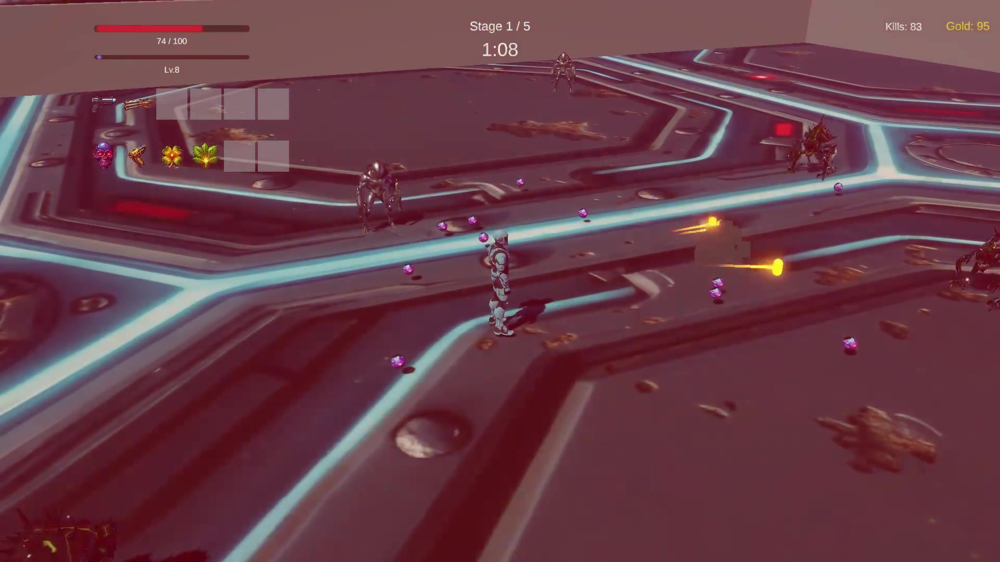
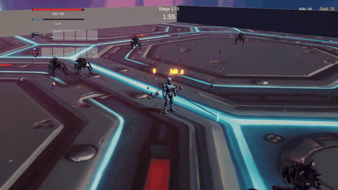
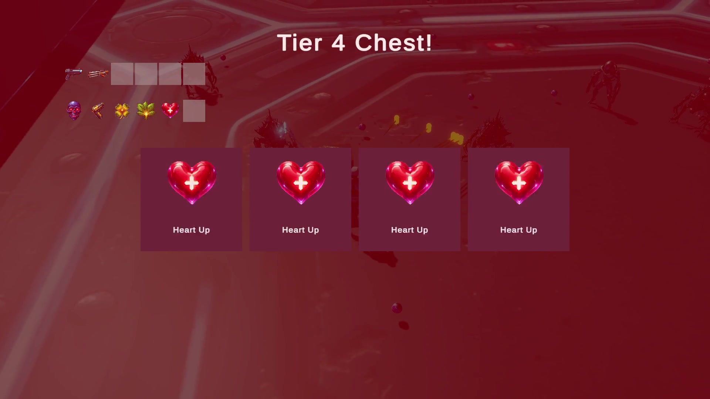
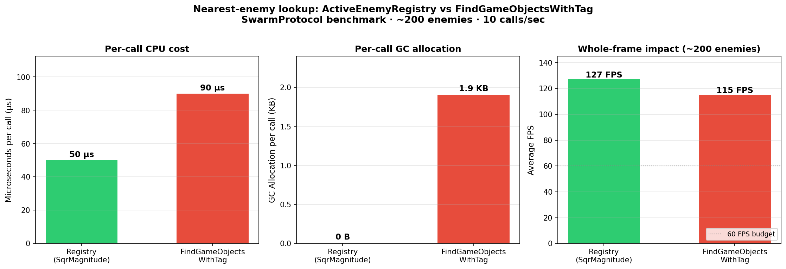

# SwarmProtocol

> A 3D real-time survivor-style arena game built around orthogonal architecture and benchmark-driven performance work.



Survive five timed stages against escalating enemy swarms. Auto-firing weapons, level-up picks between waves, treasure-chest slot machines, and a 6-weapon / 6-passive build space. Built in Unity 6.3 (URP) targeting macOS Standalone.

Inspired by *Vampire Survivors* (poncle, 2022) — reframed as a 3D arena and a case study in clean architecture.

---

## Demo



Full 30-second clip (1080p): **[Google Drive ▶](https://drive.google.com/file/d/12JRbtkcfVK8df7319K_opKi1q20CGa4V/view?usp=drive_link)**

---

## Features

- **6 weapons** with distinct fire strategies — Pulse Rifle, Scattergun, Power Fist (melee), Nduja Flamethrower, Flail (orbital), Poison Aura
- **4 enemy archetypes** — Swarmer, Ranged, Tank, Elite (drops a chest on death)
- **10 passive items** stacked through a decorator chain — Spinach (Might), Bracer / Leather Armor (Armor), Heart Up (Max HP), Wings (Move Speed), Candelabra (Area), Clover Leaf (Luck), Candy Box (Recovery), Attracter (Magnet), Skull O' Maniac (Curse)
- **Slot-machine treasure chests** with tiered jackpots — pair, triple, four-of-a-kind (Overcharge), five-of-a-kind (forced Weapon Evolution)
- **Five timed stages** with escalating spawn brackets, ranged enemies, tanks, and elite drops
- **Custom audio + sprites** generated through Unity AI tooling
- **Built-in performance harness** — toggle benchmark methods at runtime, dump profiler-captured CSVs



---

## Architecture

The whole game is organized so that adding a new enemy, weapon, or passive is **content work, not engine work**.

| Concern | Pattern | Why |
|---|---|---|
| Game-state coordination | **FSM + EventBus** | Systems subscribe to `OnGameStateChanged` independently — no god-class manager |
| Weapon / enemy behavior | **Strategy-as-ScriptableObject** | One generic host runs a SO asset. New weapon = new `FireStrategySO` subclass + asset |
| Stat stacking | **Decorator chain (`IStatProvider`)** | Each passive wraps the chain. New stat = one `StatType` enum value |
| Enemy queries | **`ActiveEnemyRegistry`** | Cached list + `sqrMagnitude` — bypasses `Physics.OverlapSphere` and `FindGameObjectsWithTag` |
| Spawn churn | **Generic `ObjectPoolManager`** | Auto-creates pools on first `Get<T>()`. Every projectile, enemy, gem, coin implements `IPoolable` |
| Hot-path measurement | **`ProfilerMarker`** rows | Named timeline rows isolate algorithm cost from frame noise |

### Decorator chain in action

```csharp
IStatProvider chain = new BaseStatProvider(baseValues);
foreach (var passive in _appliedPassives)
    chain = new PassiveDecorator(chain, passive.statType, passive.value, passive.isPercentage);
```

Calling `chain.Get(StatType.Might)` walks the chain bottom-up. Adding a new stat costs one enum value — every existing piece of plumbing handles it automatically.

### Strategy-as-ScriptableObject

```csharp
public override void Execute(FireContext ctx)
{
    float sqrRange = (ctx.WeaponData.range * ctx.AreaMultiplier) * ...;
    ActiveEnemyRegistry.Instance?.GetEnemiesInRange(ctx.FirePoint.position, sqrRange, _hitBuffer);
    foreach (var enemy in _hitBuffer)
        DamageSystem.ApplyDamage(enemy, damage, ...);
}
```

`AuraStrategySO`, `RapidFireStrategySO`, `OrbitalStrategySO`, etc. are each one short file plus a SO asset. The same `StrategyWeapon` host runs all of them.

---

## Performance

A built-in `BenchmarkRunner` flips between optimized and naive implementations at runtime so the comparison is apples-to-apples on the same scene.



| Metric | `ActiveEnemyRegistry` | `FindGameObjectsWithTag` |
|---|---|---|
| Per-call cost (~200 enemies) | ~50 µs | ~90 µs (**1.8× slower**) |
| GC alloc per call | **0 B** | ~1.9 KB |
| Steady-state GC pressure | none | ~19 KB/s |

`FindGameObjectsWithTag` returns a fresh `GameObject[]` on every call — that array becomes garbage and drives periodic `GC.Collect` spikes. Registry holds a single cached list and walks it with `sqrMagnitude` (no square root, no physics broad-phase).

The same pattern (custom `ProfilerMarker` + runtime toggle) was used to validate **`Physics.OverlapSphereNonAlloc` vs Registry** for AOE detection and **`Instantiate`/`Destroy` vs `ObjectPool`** for projectile churn. See `benchmark.md` for the full protocol.

---

## Tech Stack

- **Unity 6.3** (`6000.3.9f1`) — Universal Render Pipeline
- **C#** with the new Input System
- **Cinemachine** for the orbiting third-person camera
- **TextMeshPro** for all UI text
- **NavMesh** for enemy pathing
- **Unity AI** for procedural sprite + sound generation

---

## Build & Run

**Requirements:** Unity 6.3 (`6000.3.9f1`) via Unity Hub.

```bash
git clone https://github.com/AlperenGarip/SwarmProtocol.git
```

1. Open the project root in Unity Hub
2. Open `Assets/Scenes/GameArena.unity`
3. Press **Play** (`Cmd+P`)

For a standalone build: **File → Build Settings → macOS → Build**.

### Hotkeys (in Editor)

| Key | Action |
|---|---|
| `WASD` | Move (camera-relative) |
| `Mouse` | Aim (auto-targets nearest enemy) |
| `Esc` | Pause |
| `F1`–`F12` | Benchmark harness controls (see `benchmark.md`) |

---

## Project Layout

```
Assets/_Project/
├── Scripts/
│   ├── Core/           GameManager, EventBus, ObjectPoolManager, ActiveEnemyRegistry
│   ├── Player/         Controller, Health, Stats (IStatProvider chain), XP
│   ├── Combat/         WeaponManager, WeaponBase, ProjectileBase, DamageSystem
│   │   └── Strategies/ FireStrategySO subclasses (Aura, Orbital, RapidFire, ...)
│   ├── Enemies/        EnemyBase, BehaviorDrivenEnemy, EnemyNavigation
│   │   └── Behaviors/  EnemyBehaviorSO subclasses
│   ├── Stats/          IStatProvider, BaseStatProvider, PassiveDecorator
│   ├── Progression/    StageManager, UpgradeManager, GoldManager
│   ├── Chest/          ChestRewardResolver, JackpotProcessor, OverchargeManager
│   ├── UI/             HUDController, LevelUpUI, ChestOpenUI, SlotMachineColumn, ...
│   └── Tools/          BenchmarkRunner
├── ScriptableObjects/  Weapons, Enemies, Passives, Stages, Strategies (SO assets)
├── Prefabs/            Player, Enemies, Projectiles, Pickups, UI panels
├── Art/                Sprites, materials, sky
└── Audio/              Music + SFX clips, AudioLibrarySO
```

---

## Design Patterns Used

- **Singleton** — `GameManager`, `ObjectPoolManager`, `ActiveEnemyRegistry`, `AudioService`, `GoldManager`
- **Observer / Event Bus** — `EventBus` static hub + typed `Event<T>` channels
- **Strategy** (as SO) — `FireStrategySO`, `EnemyBehaviorSO`
- **Object Pool** — `ObjectPoolManager` + `IPoolable`
- **Decorator** — `IStatProvider` → `BaseStatProvider` → `PassiveDecorator` chain
- **State Machine** — `GameManager` game states, `EnemyAI` (Idle → Chase → Attack → Death)
- **Registry** — `ActiveEnemyRegistry`
- **Facade** — `PlayerStats` properties wrap `_chain.Get(StatType.X)`

---

## Roadmap

- Migrate the remaining legacy weapons (`RapidFireWeapon`, `ShotgunWeapon`) to the SO strategy host
- Replace placeholder character art with rigged 3D characters + animation sets
- Multiplayer co-op via Mirror — would stress-test the event architecture under network sync
- Persistent save state across application restarts
- Two more profiler challenges: chest VFX render load, projectile-physics scaling

---

## Credits

- **Author:** Alperen Garip
- **Inspiration:** *Vampire Survivors* (poncle, 2022)
- **Course:** CMPE 485 — Term Project, Option B
- **Tooling:** Unity 6.3, Cinemachine, Unity AI

---

## License

MIT — see [`LICENSE`](LICENSE) for details.
